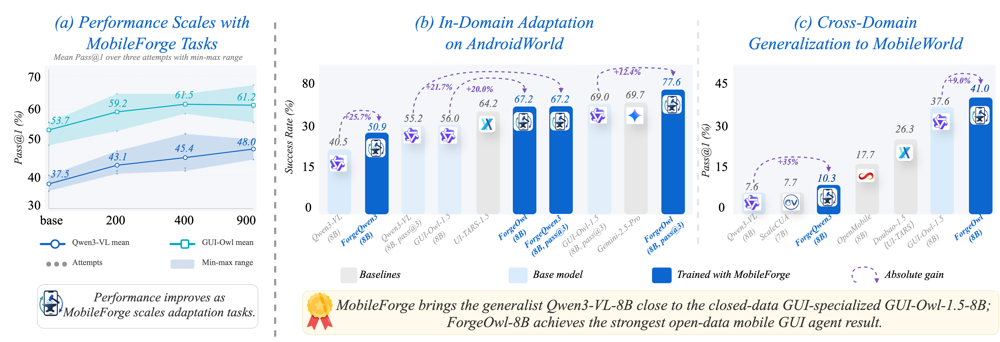
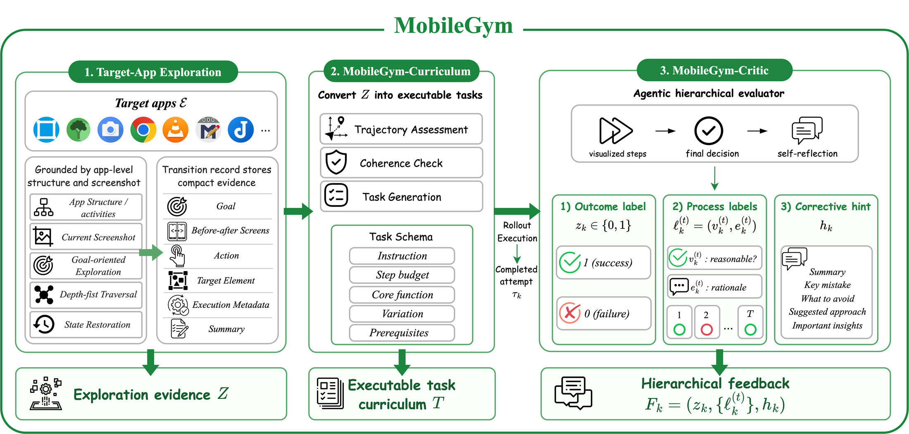
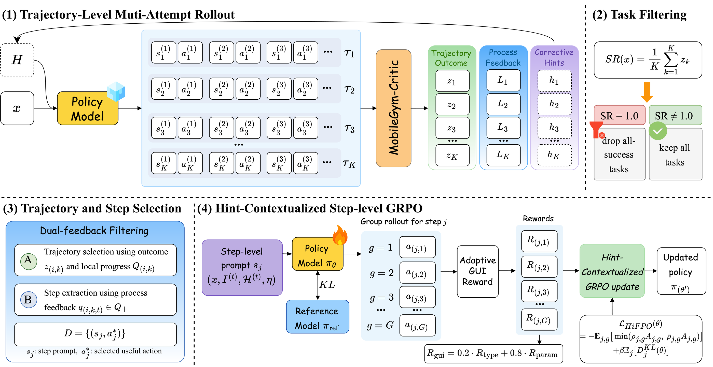

<div align="center">

<h1>
  <br>
  MobileForge: Annotation-Free Adaptation for Mobile GUI Agents with Hierarchical Feedback-Guided Policy Optimization
</h1>

[](https://mobile-forge.github.io/)
[](https://arxiv.org/abs/2606.19930)
[](https://huggingface.co/collections/lgy0404/mobileforge-models)
[](https://huggingface.co/collections/lgy0404/mobileforge-datasets)
[](https://huggingface.co/datasets/lgy0404/mobileforge-benchmark-results)
[](https://opensource.org/licenses/Apache-2.0)

<b>MobileForge turns real target-app interaction into executable curricula, hierarchical rollout feedback, and hint-contextualized policy updates without human-written tasks, demonstrations, or reward labels.</b>

</div>

## 🔥 News

- **2026-06-23**: Released the MobileForge [codebase](https://github.com/kwai/MobileForge), [🤗 datasets](https://huggingface.co/collections/lgy0404/mobileforge-datasets), and [🤗 benchmark results](https://huggingface.co/datasets/lgy0404/mobileforge-benchmark-results).
- **2026-06-19**: MobileForge preprint is available on [arXiv](https://arxiv.org/abs/2606.19930).
- **2026-06-10**: Released all MobileForge [🤗 model checkpoints](https://huggingface.co/collections/lgy0404/mobileforge-models).

## 📊 Main Results

<p align="center">
  
</p>

MobileForge improves mobile GUI agents through annotation-free target-app adaptation. With GUI-Owl-1.5-8B, MobileForge reaches **67.24% Pass@1** and **77.59% Pass@3** on AndroidWorld, and **41.03% SR** on MobileWorld. With Qwen3-VL-8B, MobileForge raises AndroidWorld Pass@3 to **67.24%**.

## 🧩 Overview

MobileForge adapts mobile GUI agents without collecting task-specific human annotations. It combines **MobileGym** for target-app exploration and automatic curriculum generation with **HiFPO** for hint-guided rollout, hierarchical trajectory feedback, and step-level GRPO training.

### MobileGym: target-app interaction and hierarchical feedback

MobileGym grounds the adaptation loop in real target-app interaction. It explores Android apps, mines executable curriculum tasks from interaction traces, executes rollouts, and evaluates completed attempts with outcome labels, step-level process feedback, and corrective hints.

<p align="center">
  
</p>

### HiFPO: feedback-guided policy optimization

HiFPO turns MobileGym feedback into training signals. It runs hint-guided multi-attempt rollouts, filters mastered tasks and low-quality steps, retains informative experience, and trains the agent with hint-contextualized step-level GRPO.

<p align="center">
  
</p>

## 📁 Repository Guide

```text
MobileForge/
|-- explore/                       # Target-app exploration and MobileGym-Curriculum task generation
|-- rollout/                       # Hint-guided rollout, critic feedback, and rollout-to-GRPO processing
|-- training/                      # VERL-derived MobileForge step-level GRPO training stack
|-- evaluation/
|   |-- androidworld/              # AndroidWorld evaluation fork and reproduction utilities
|   `-- mobileworld/               # MobileWorld reproduction notes and helpers
|-- docs/                          # Models, data release, pipeline, and evaluation-result mapping
|-- metadata/                      # Public release manifests and model/result maps
|-- CITATION.cff
|-- citations.bib
`-- README.md
```

## 🚀 Where to Start

The root README is intentionally concise. Detailed setup and commands live in the component README files.

| Goal | Start here | What it covers |
| --- | --- | --- |
| Explore target apps and generate tasks | [`explore/`](explore/README.md) | Target-app exploration, APK cache, parallel exploration, and MobileGym-Curriculum task generation. |
| Run hint-guided rollouts and build GRPO data | [`rollout/`](rollout/README.md) | Multi-attempt rollout, MobileGym-Critic feedback, hint reuse, and rollout-to-training-data conversion. |
| Train with HiFPO / step-level GRPO | [`training/`](training/README.md) | Training environment, GRPO launch script, reward function, and utility tools. |
| Reproduce benchmark runs | [`evaluation/`](evaluation/) and [`docs/evaluation_results.md`](docs/evaluation_results.md) | AndroidWorld and MobileWorld artifact mapping and evaluation notes. |
| Inspect release manifests | [`docs/`](docs/) and [`metadata/`](metadata/) | Model list, dataset release notes, pipeline overview, and model-to-result mapping. |

## 📦 Release Index

| Artifact | Link | Details |
| --- | --- | --- |
| Models | [🤗 MobileForge Models collection](https://huggingface.co/collections/lgy0404/mobileforge-models) | Main ForgeQwen3 / ForgeOwl checkpoints and scaling-ablation checkpoints. See [`docs/models.md`](docs/models.md). |
| Datasets | [🤗 MobileForge Datasets collection](https://huggingface.co/collections/lgy0404/mobileforge-datasets) | Training data, exploration trajectories, and generated tasks. See [`docs/data_release.md`](docs/data_release.md). |
| Benchmark results | [🤗 `lgy0404/mobileforge-benchmark-results`](https://huggingface.co/datasets/lgy0404/mobileforge-benchmark-results) | AndroidWorld and MobileWorld archives. See [`docs/evaluation_results.md`](docs/evaluation_results.md). |
| Paper | [arXiv:2606.19930](https://arxiv.org/abs/2606.19930) | Technical report and citation metadata. |

## Citation

```bibtex
@article{liu2026mobileforge,
  title={MobileForge: Annotation-Free Adaptation for Mobile GUI Agents with Hierarchical Feedback-Guided Policy Optimization},
  author={Liu, Guangyi and Zhao, Pengxiang and Wu, Gao and Yin, Yiwen and Li, Mading and Liu, Liang and Liu, Congxiao and Qi, Zhang and Wang, Mengyan and Guo, Liang and others},
  journal={arXiv preprint arXiv:2606.19930},
  year={2026}
}
```

## Contact

For questions about the paper, code, or released artifacts, contact [guangyiliu@zju.edu.cn](mailto:guangyiliu@zju.edu.cn).

## ⭐ Star History

<a href="https://www.star-history.com/#kwai/MobileForge&Date">
  <picture>
    <source media="(prefers-color-scheme: dark)" srcset="https://api.star-history.com/svg?repos=kwai/MobileForge&type=Date&theme=dark" />
    <source media="(prefers-color-scheme: light)" srcset="https://api.star-history.com/svg?repos=kwai/MobileForge&type=Date" />
    
  </picture>
</a>

## 🙏 Acknowledgements

MobileForge builds on open-source resources including
[AndroidWorld](https://github.com/google-research/android_world),
[MobileWorld](https://github.com/Tongyi-MAI/MobileWorld),
[MobileAgent](https://github.com/X-PLUG/MobileAgent),
[Qwen3-VL](https://github.com/QwenLM/Qwen3-VL),
[GUI-explorer](https://github.com/iLearn-Lab/ACL25-GUI-explorer),
[VERL](https://github.com/verl-project/verl), and
[GUI-R1](https://github.com/ritzz-ai/GUI-R1).
